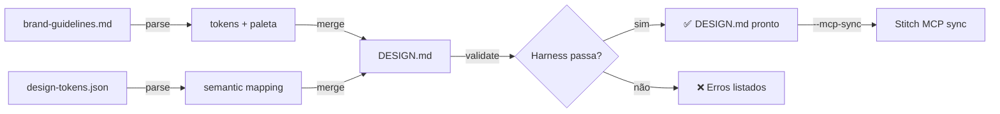

# Skill: /stitch-brand-integrate

Orquestra integração **Stitch + Claude Design + Claude Code** com design system ISSSD.

## Referência

**SPEC-178**: [Integração Stitch + Claude Design + Claude Code com Design System ISSSD](../specs/ui/SPEC-178-stitch-claude-design-integration.md)

## Uso

```bash
/stitch-brand-integrate \
  --brand docs/brand-guidelines.md \
  --tokens assets/design-tokens.json \
  --output DESIGN.md
```

### Parâmetros

| Flag | Obrigatório | Padrão | Descrição |
|------|-------------|--------|-----------|
| `--brand` | ✅ | — | Path a `docs/brand-guidelines.md` |
| `--tokens` | ✅ | — | Path a `assets/design-tokens.json` |
| `--output` | ❌ | `DESIGN.md` | Path de saída (raiz do projeto) |
| `--validate` | ❌ | `true` | Roda harness após geração |
| `--mcp-sync` | ❌ | `false` | Sincroniza com Stitch MCP |

## Fluxo



## Output

```
✓ DESIGN.md gerado (234 linhas)
✓ Tokens semânticos mapeados (45 tokens)
✓ Paleta ISSSD validada (8 cores primárias)
✓ Tipografia checada (3 font families)
✓ Harness passou (6/6 testes)
✓ MCP sync: "olefut-isssd" project atualizado
```

## Exemplo

### 1. Gera DESIGN.md

```bash
/stitch-brand-integrate
```

Output:
```markdown
# OléFUT Design System ISSSD Premium

## Colors
- Primary (Neon Green): #39FF14
- Secondary (Gold): #FFD700
- Tertiary (Pitch Green): #52B788
- Danger (Cartão Vermelho): #FF3333
- Background (CRT Black): #111417

## Typography
- Display: Press Start 2P, 1.2rem, weight 400
- Body: Pixelify Sans, 0.85rem, weight 400
- Mono: IBM Plex Mono, 1rem, weight 600

## Components
- Button: 48px height, 2px border, square corners
- Card: bevel effect (light top-left, dark bottom-right)
- Panel: dark bg (#0E1F14), border #2D6A4F
...
```

### 2. Sincroniza com Stitch MCP

```bash
/stitch-brand-integrate --mcp-sync
```

Stitch project recebe DESIGN.md como source of truth.

### 3. Claude Code lê DESIGN.md

```javascript
// Em Claude Code, durante geração
const design = await readMCPResource('stitch', 'DESIGN.md');
// Gera componentes que batem 100% com canvas
```

## Validação

Harness automático: `tests/specs/SPEC-178.test.js`

- ✅ DESIGN.md gerado
- ✅ 100% cobertura (brand + tokens)
- ✅ Zero erros de sintaxe
- ✅ Tokens mapeados semanticamente
- ✅ MCP consegue ler
- ✅ Build não regride

## Troubleshooting

### "brand-guidelines.md não encontrado"
```bash
# Verifique path
ls -la docs/brand-guidelines.md
```

### "DESIGN.md falha validação"
```bash
# Roda harness detalhado
npm run test:specs -- SPEC-178 --verbose
```

### "MCP sync falha"
```bash
# Checka .claude/settings.json
cat .claude/settings.json | grep stitch
# Verifica token de auth
echo $STITCH_API_KEY
```

## Implementação

**Script**: `scripts/generate-design-md.js`

```javascript
#!/usr/bin/env node
const fs = require('fs');
const brandGuide = require('./docs/brand-guidelines.md');
const tokens = require('./assets/design-tokens.json');

function generateDesignMD(brand, tokens) {
  const markdown = `# OléFUT Design System ISSSD Premium

## Colors
${Object.entries(tokens.semantic.color).map(([name, config]) => 
  `- ${name}: ${config.value} (${config.description})`
).join('\n')}

## Typography
${Object.entries(tokens.semantic.typography).map(([name, config]) =>
  `- ${name}: ${config.fontFamily}, weight ${config.fontWeight}`
).join('\n')}

## Components
...
`;
  
  fs.writeFileSync('DESIGN.md', markdown);
  console.log('✓ DESIGN.md gerado');
}

generateDesignMD(brandGuide, tokens);
```

**Install**:
```bash
npm install --save-dev stitch-brand-integration-skill
# Ou manual: copiar skill em ~/.claude/skills/
```

## Ligação ao SDD

Esta skill implementa **SPEC-178** integralmente:
- Input: brand + tokens (SPEC-178 §2)
- Output: DESIGN.md + skill (SPEC-178 §3)
- Validação: harness SPEC-178 §4
- Forbidden: constraints SPEC-178 §5

Toda evolução desta skill exige:
1. Atualizar SPEC-178 se scope muda
2. Rodar harness antes de deploy
3. Commitar com linkagem `[SPEC-178]`

---

**Versão**: 1.0  
**Status**: Draft (aguardando SPEC-178 aprovação)  
**Referência**: SPEC-178  
**Última atualização**: 2026-05-13
